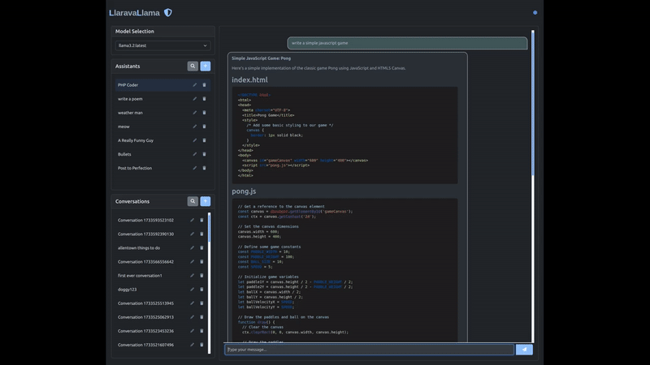

# LlaraveLlama: Your Private AI Chat Suite

Welcome to LlaraveLlama - where Laravel and Ollama come together like peanut butter and chocolate to create the most versatile private chat suite available. Built for privacy enthusiasts and AI aficionados alike, LlaraveLlama brings enterprise-level features to your local machine.

## 📸 Preview

<div align="center">
    
    <br />
   <em>LlaraveLlama in action - showcasing features, themes and debug mode</em>
   <br>
    <a href="LICENSE"></a>
</div>

## ✨ Why LlaraveLlama?

LlaraveLlama combines the robust PHP framework Laravel with Ollama's powerful local AI models to create a completely private, self-hosted chat experience. From its eye-pleasing daylight theme to its soothing moonlight mode, every detail is crafted for your comfort and productivity.

## 🚀 Key Features

- **100% Private**: Everything runs locally - your data never leaves your system
- **Mobile-Ready**: Responsive design that looks stunning on all devices
- **Beautiful Rendering**: Markdown and code blocks are rendered with syntax highlighting
- **Quick Copy**: One-click copying for any message or code block
- **Powerful Search**: Deep conversation search to find that important discussion from hundreds of chats ago
- **Custom Assistants**: Create and customize AI assistants for different tasks
- **Offline Capable**: Includes local CDN libraries - chat without internet once set up
- **JSON Storage**: Simple, efficient local storage for all your conversations
- **Theme Options**: Soft daylight and tender moonlight themes for comfortable viewing
- **Lightweight**: Runs smoothly on modest hardware - from cloud VPS to your old laptop
- **Full Debug Mode**: Out-of-the-box debugging support for mobile testing and development
- **Service Debugging**: Easily toggle comprehensive service-level debugging for troubleshooting
- **Model Health Recovery**: Automatic model health monitoring and recovery system that handles Ollama instabilities with automated repair and restart capabilities
## 🎮 Live Demo

[Try LlaraveLlama Now](https://llaravellama.com)

### Demo Environment Notes:
- Hosted on a basic Linode server - performance may vary with concurrent users
- All conversations are public and visible to other demo users
- Assistants and Conversations may be deleted at any time.
- Perfect for a quick test drive before your local installation

The demo is intended as a preview of LlaraveLlama's features. For the best experience, we recommend running your own private instance.

## 🛠 Technical Requirements

- PHP 8.1 or higher
- PHP-Curl
- Php-XML
- Composer
- Node.js & NPM
- Ollama installation
- Basic system for running LLMs (Most modern laptops will work!)

## 📱 Mobile Access Setup

1. Deploy LlaraveLlama on your:
    - Local PC
    - Cloud server (e.g., Linode)
2. Configure port forwarding
3. Connect to the ip address the machine running the app: `http://your_computer_ip_address:8000/`
4. Enjoy a premium mobile AI chat experience!

## 💾 Installation

```bash
# Clone the repository
git clone https://github.com/Better-Call-Jason/LlaraveLlama.git

# Install Ollama (Linux)
curl https://ollama.ai/install.sh | sh
# Start Ollama service
systemctl start ollama

# Install at least one model
ollama pull llama3.2:3b

# Install dependencies
composer install
npm install

# Set up environment
cp .env.example .env
php artisan key:generate

# Build for production
npm run prod

# Start the server
nohup php artisan serve --host=0.0.0.0 --port=8000 > storage/logs/artisan.log 2>&1 &

# Open port in firewall if needed
sudo ufw allow 8000
```

### Your private LlaraveLlama app will be available at: 
  - `http://localhost:8000`
  - `http://your_computer_ip_address:8000/` for use on other locally connected devices

## 🔍 Debugging Features

LlaraveLlama includes comprehensive debugging capabilities that can be easily controlled through your environment settings.

### Enabling Debug Mode

Debug mode is controlled through your `.env` file:

```env
APP_DEBUG=true  # Enable debugging features
APP_DEBUG=false # Disable debugging features (production setting)
```

This setting automatically controls:
- The debug panel visibility
- Service operation logging
- System interaction details
- API call monitoring

No code changes are required - simply update your .env file and clear the configuration:
```bash
php artisan config:clear
php artisan cache:clear
```

### Production Environments

For production deployments:
1. Ensure APP_DEBUG is set to false in your .env file
2. Clear all configuration caches
3. Verify debug panel is not visible
4. Confirm no sensitive information is exposed

This configuration provides optimal security and performance while maintaining the ability to quickly enable debugging when needed.

### Mobile Debugging

The debug panel is fully responsive and works seamlessly on mobile devices when enabled through the .env file - no additional configuration required.

## 👨‍💻 About the Author

Created by a passionate PHP/JS full-stack developer who believes in the democratization of AI technology. This project started as a personal tool, evolved through family use, and is now shared with the world. It represents a belief that powerful AI tools should be accessible to everyone while maintaining privacy and control over their data.

## 🌟 The Vision

LlaraveLlama was born from the amazing reality that today's LLM technology can run efficiently on consumer hardware. As these models become more powerful and accessible, tools like LlaraveLlama make it possible for everyone to harness their potential while maintaining complete privacy and control.

## 🤝 Contributing

Your contributions are welcome! Whether it's bug fixes, feature additions, or documentation improvements, feel free to submit a pull request.

## 📜 License

LlaraveLlama is open-source software licensed under the [MIT license](LICENSE). See the [LICENSE](LICENSE) file for the full license text.
