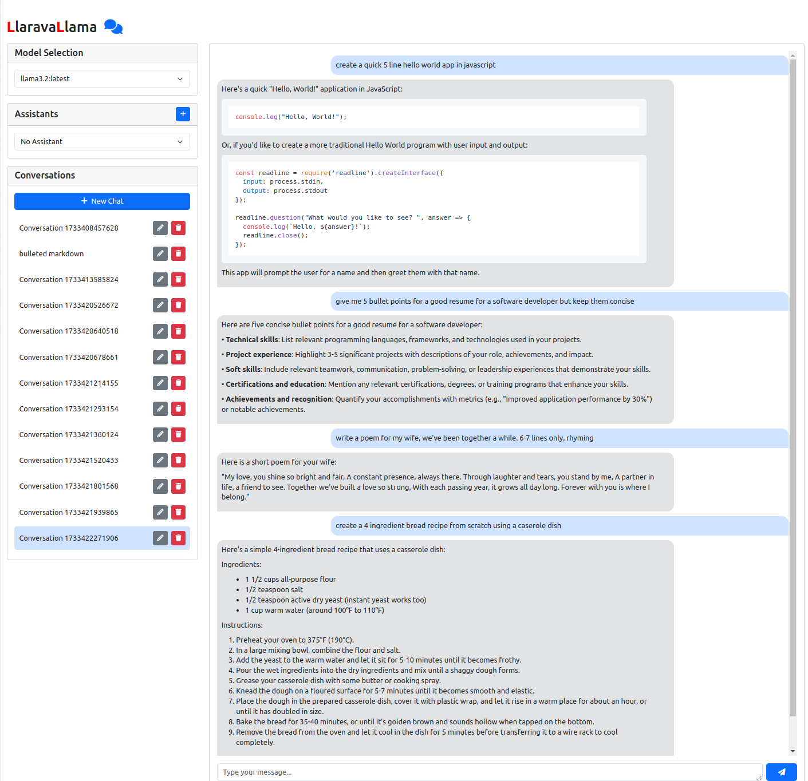

# LlaravaLlama: Private AI Chat Suite

LlaravaLlama is a self-hosted, private AI chat solution built with Laravel and Ollama. It provides a modern, intuitive interface for interacting with local LLMs while maintaining all your data on your own system.

## Features

- 🚀 Real-time streaming responses
- 💾 Local data storage using JSON files
- 🎨 Beautiful, responsive UI with code syntax highlighting
- 📝 Markdown support for responses
- 👥 Custom assistants with system prompts
- 🔄 Multiple model support
- 📋 One-click copying of messages and code blocks

## Preview


## Prerequisites

Before you begin, ensure you have the following installed:
- PHP >= 8.1
- Composer
- Node.js & NPM
- [Ollama](https://ollama.ai)

## Installation

1. Clone the repository:
```bash
git clone https://github.com/yourusername/laravallama.git
cd laravallama
```

2. Install PHP dependencies:
```bash
composer install
```

3. Install and compile frontend assets:
```bash
npm install
npm run dev
```

4. Set up your environment:
```bash
cp .env.example .env
php artisan key:generate
```

5. Install Ollama and pull your first model:
```bash
# Install Ollama - visit https://ollama.ai for installation instructions
# For Linux:
curl https://ollama.ai/install.sh | sh

# Pull a model (example: Llama2)
ollama pull llama2
```

6. Start the application:
```bash
# In one terminal:
php artisan serve

# In another terminal:
npm run dev

# Start Ollama in another terminal:
ollama serve
```

Visit `http://localhost:8000` to start using LaravaLlama!

## Using Multiple Models

1. Pull additional models using Ollama:
```bash
ollama pull mistral
ollama pull codellama
```

2. Models will automatically appear in the model selector dropdown in the UI.

## Creating Assistants

1. Click the '+' button in the Assistants section
2. Name your assistant
3. Add a system prompt that defines the assistant's behavior
4. Save and select your assistant for use in conversations

## Directory Structure

- `/storage/app/data/conversations` - Stores chat conversations
- `/storage/app/data/assistants` - Stores assistant configurations
- `/storage/app/data/models` - Stores model configurations

## Security

All data is stored locally on your system. No external API calls are made except to your local Ollama instance.

## Contributing

Contributions are welcome! Please feel free to submit a Pull Request.

## License

This project is open-sourced software licensed under the MIT license.
